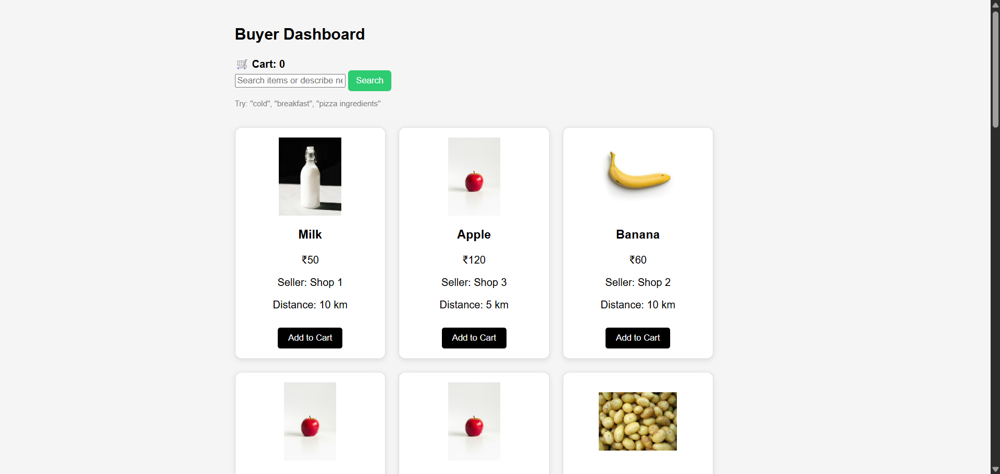
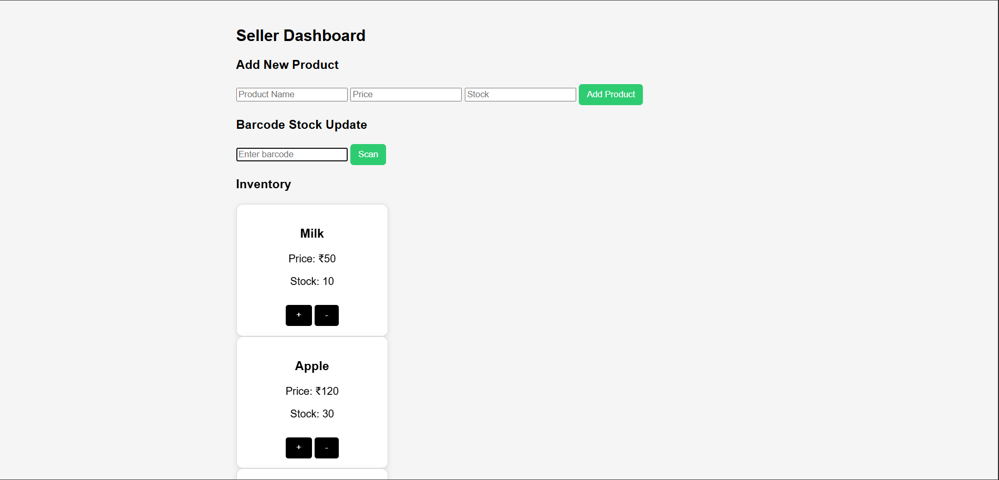

# Smarter Blinkit

Smarter Blinkit is a smart grocery marketplace that connects buyers with nearby local sellers.
The platform helps users find products quickly, manage inventory efficiently, and optimize purchases using an AI-assisted shopping experience.

This project was built as part of the **CONSOLE Project Phase (BuildVerse)**.

---

# Problem Statement

Traditional online grocery platforms often prioritize large warehouses and centralized supply chains.
This project aims to connect **local neighborhood sellers with buyers**, making shopping faster and more efficient.

Key goals:

* Help buyers find products quickly
* Allow sellers to manage inventory easily
* Optimize shopping through intelligent suggestions

---

# Features

## Buyer Dashboard

* Browse available grocery products
* Search for items
* AI assistant suggests relevant items (example: "pizza" → flour, cheese, tomato)
* Category filtering
* Product images and distance display
* Add items to cart
* Cart system with checkout

---

## Seller Dashboard

* Add new products to inventory
* Manage stock levels
* Increase or decrease stock
* Barcode-based stock update
* Low stock warning system
* Inventory displayed in a clean table layout

---

## Smart Cart Optimization

Items in the cart are grouped by seller to optimize purchasing from nearby shops.

Example:

Shop 1
Milk
Cheese

Shop 2
Banana
Tomato

---

# Tech Stack

Frontend

* HTML
* CSS
* JavaScript

Backend

* Node.js
* Express (for AI assistant endpoint)

Storage

* LocalStorage (for inventory and cart)

AI

* Intent-based assistant system

---

# Project Structure

```
smarter_blinkit
│
├── assets
│   ├── products
│   └── screenshots
│
├── css
│   └── style.css
│
├── js
│   ├── auth.js
│   ├── search.js
│   ├── cart.js
│   ├── cartPage.js
│   └── seller.js
│
├── server
│   └── server.js
│
├── buyer.html
├── seller.html
├── cart.html
├── login.html
└── README.md
```

---

# Screenshots

## Buyer Dashboard



## Seller Dashboard



---

# How to Run the Project

1. Clone the repository

```
git clone https://github.com/coderaj2006/Smarter-Blinkit.git
```

2. Open the project folder

3. Start the AI server

```
node server/server.js
```

4. Open the pages in your browser

```
buyer.html
seller.html
```

---

# Future Improvements

* Real AI assistant using LLM APIs
* Database integration
* Real-time inventory updates
* Payment integration
* Location-based seller discovery

---

# Project Status

Stage 1 (Core System) Completed

The project successfully implements a buyer-seller marketplace with inventory management and smart shopping assistance.
